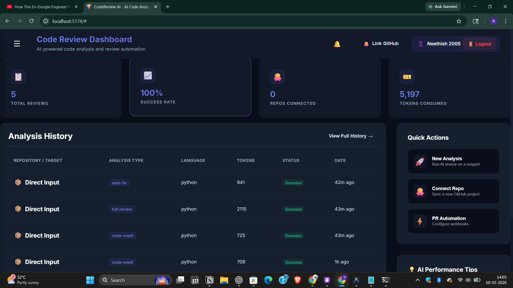
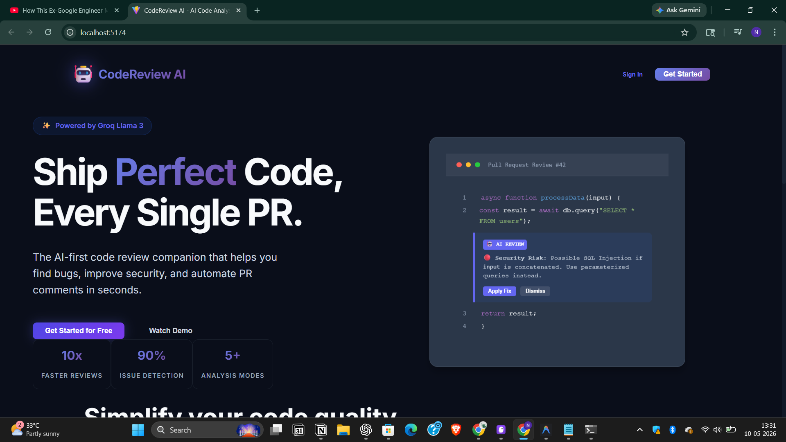
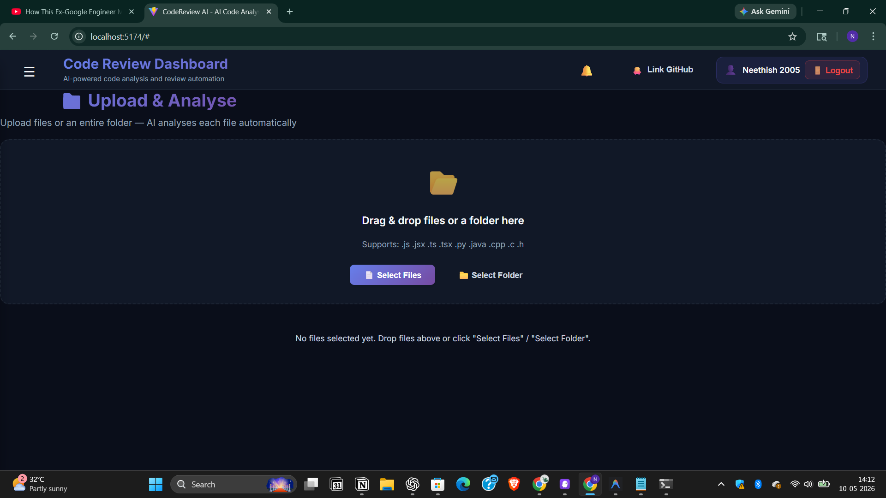
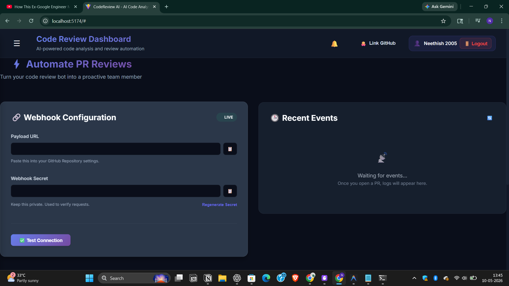
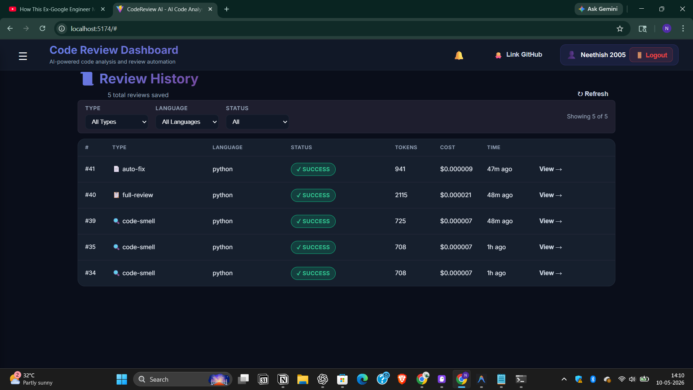
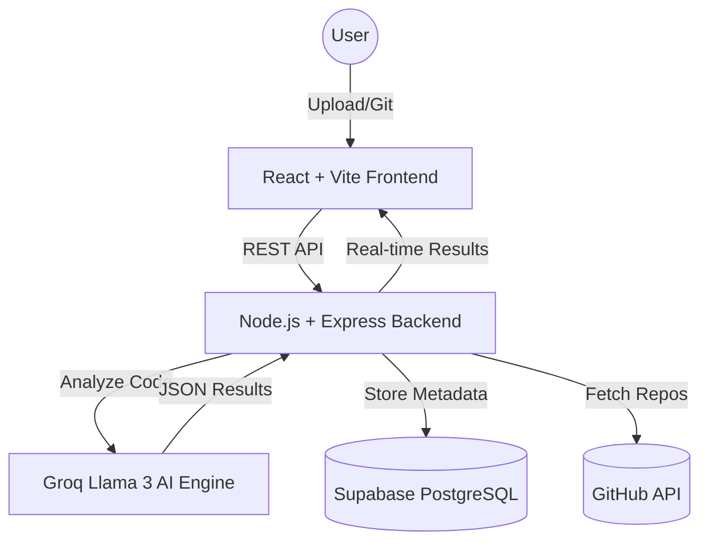

# Code Review Bot 🤖

[](https://code-review-bot-green.vercel.app)
[](https://opensource.org/licenses/MIT)

An AI-powered code analysis and review platform designed for modern engineering teams. Code Review Bot automates PR audits, security scans, and performance analysis using the Groq Llama 3 LLM.

## 🚀 Live Demo
**Frontend:** [https://code-review-bot-green.vercel.app](https://code-review-bot-green.vercel.app)  
**Backend API:** [https://code-review-bot-ag9b.onrender.com](https://code-review-bot-ag9b.onrender.com)

---

## 📺 Product Showcase

### Main Dashboard


### 🖼️ Feature Highlights
| Landing Page | AI Code Analyser |
|--------------|------------------|
|  |  |

| Webhook Config | Review History |
|----------------|----------------|
|  |  |

---

## 🎥 Video Walkthrough
**[Watch the Demo Video](./screenshots/demo_video.mp4)**

---

## 🏗️ Architecture



---

## ✨ Key Features

### 🔍 Multi-Dimensional Analysis
- **Code Smells**: Identify technical debt and maintainability issues.
- **Security Scans**: Detect vulnerabilities, hardcoded secrets, and unsafe patterns.
- **Performance Audit**: Big-O complexity analysis and optimization suggestions.
- **Complexity Mapping**: Measure cyclomatic complexity and nesting depth.

### 🐙 GitHub Integration
- **OAuth Login**: Secure authentication with GitHub.
- **Repository Browser**: Direct access to your GitHub projects.
- **PR Automation**: (In Development) Automated comments on pull requests.

### 🛠️ Developer Experience
- **Monaco Editor**: High-performance code editing with syntax highlighting.
- **AI Code Explainer**: Plain-English breakdowns of complex logic.
- **Smart Auto-Fix**: One-click suggestions to refactor code.
- **Notification System**: Real-time alerts for analysis completion.

---

## 🛠️ Tech Stack

- **Frontend**: React 18, TypeScript, Vite, Monaco Editor, Vanilla CSS.
- **Backend**: Node.js, Express, TypeScript.
- **AI Engine**: Groq Cloud (Llama 3-70b/8b).
- **Database**: Supabase (PostgreSQL) with Transaction Pooling.
- **Authentication**: GitHub OAuth 2.0.

---

## ⚙️ Local Setup

### 1. Clone the repository
```bash
git clone https://github.com/NeethishS/code-review-bot.git
cd code-review-bot
```

### 2. Configure Backend
Create `backend/.env`:
```env
PORT=3001
DB_USER=your_user
DB_HOST=your_host
DB_NAME=postgres
DB_PASSWORD=your_password
DB_PORT=6543
GROQ_API_KEY=your_key
GITHUB_CLIENT_ID=your_id
GITHUB_CLIENT_SECRET=your_secret
JWT_SECRET=your_jwt_secret
```

### 3. Configure Frontend
Create `.env`:
```env
VITE_BACKEND_URL=http://localhost:3001
```

### 4. Run the application
```bash
# Backend
cd backend
npm install
npm run dev

# Frontend
cd ..
npm install
npm run dev
```

---

## 📋 Roadmap
- [x] Multi-file analysis support
- [x] AI Code Explainer module
- [x] Persistent Notification system
- [ ] Automated PR commenting agent
- [ ] Team collaboration workspaces
- [ ] Custom security rulesets

## 📄 License
Distributed under the MIT License. See `LICENSE` for more information.

---
*Built with ❤️ for better code quality.*
